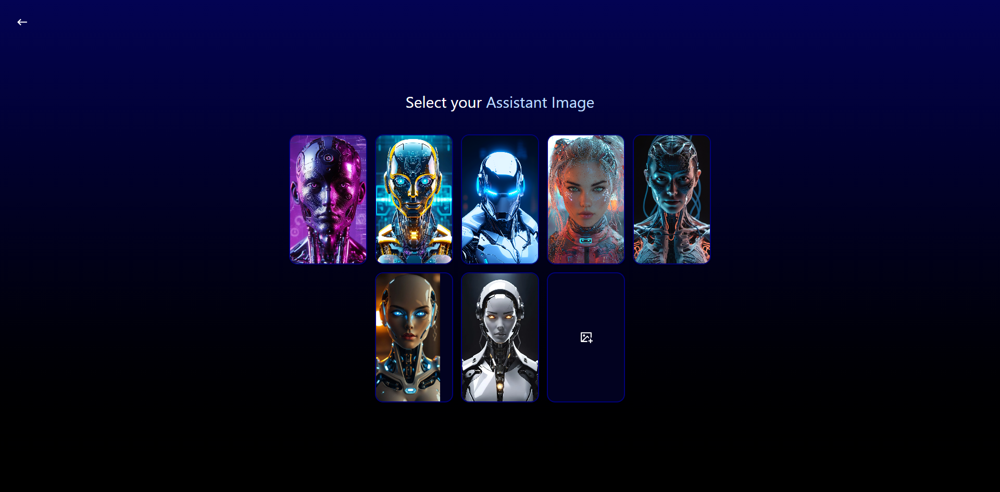

# 🤖 YourAssistant – AI Voice & Text Assistant

<p align="center">
  
</p>

An AI-powered **voice and text-based personal assistant** built using the **MERN stack**, **Google Gemini API**, and **JWT authentication**.
YourAssistant helps users interact naturally with AI—through **voice commands or chat**—to get instant answers, perform tasks, and access personalized features securely.

🌐 **Live Demo:** [your-assistant.onrender.com](https://your-assistant.onrender.com/)

---

## 🚀 Features

* 🎙️ **AI Voice & Text Interface** – Interact using speech or text, powered by **Gemini/LLM integration**.
* 🔐 **JWT Authentication & RBAC** – Secure login, session management, and role-based access control.
* 🧠 **LLM Integration (Gemini)** – Uses large language models to understand context and generate intelligent responses.
* ⚙️ **Full MERN Stack Architecture** – React frontend, Express backend, Node.js server, and MongoDB database.
* 🗣️ **Real-Time Speech Recognition** – Converts user voice input to text and generates spoken replies using AI.
* ☁️ **Deployed on Render** – CI/CD setup with containerized deployment.

---

## 🧩 Tech Stack

**Frontend:** React.js, TailwindCSS, Axios, SpeechRecognition API
**Backend:** Node.js, Express.js, Gemini API, JWT, Bcrypt
**Database:** MongoDB (Mongoose)
**AI & APIs:** Gemini API, OpenAI-compatible endpoints (LLM processing)
**Deployment:** Render, Docker

---

## 🧠 How It Works

1. Users log in securely using **JWT-based authentication**.
2. The app captures text or voice input through the **SpeechRecognition API**.
3. Requests are sent to the **Gemini LLM API**, which processes and returns a contextual response.
4. Responses are displayed in chat or converted into voice replies for an interactive experience.

---

## 📦 Installation

```bash
# Clone the repository
git clone https://github.com/shakshipatel/virtual-assistant.git

# Navigate to the project
cd your-assistant

# Install dependencies
npm install

# Start the client and server
npm run dev
```

---

## 🛠️ Environment Variables

Create a `.env` file in the root directory and add the following:

```
MONGO_URI=your_mongodb_connection
JWT_SECRET=your_secret_key
GEMINI_API_KEY=your_gemini_api_key
PORT=5000
```

---

## 📈 Future Enhancements

* Add support for **multilingual AI conversations**.
* Enable **custom AI workflows and integrations** (calendar, notes, mail).
* Introduce **LLMOps logging** and analytics dashboard.

---

## 👩‍💻 Author

**Shakshi Patel**
🔗 [GitHub](https://github.com/shakshipatel) | 💼 [LinkedIn](https://www.linkedin.com/in/shakshi-patel)
